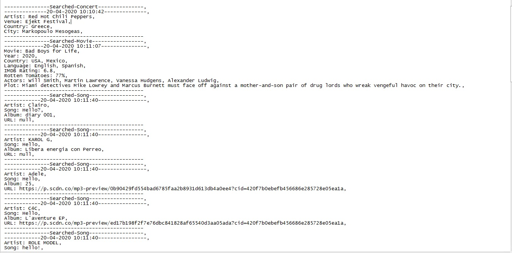
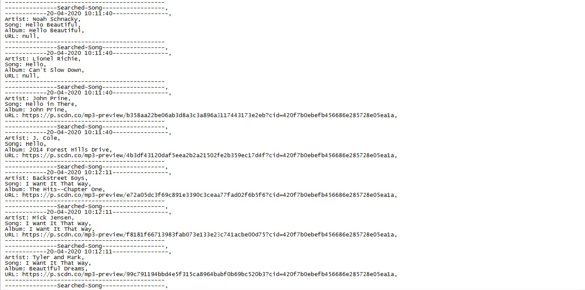

# Liri-Node-App #
### Video Demo Link below: ###
https://youtu.be/vw7TTaYNkGE

**When user enter "Contert-this" and leave it empty it will show "Recommended Concert - Rammstein",
same will be for "Movie-this - Mr.Nobody" and "Spotify-this-song - Ace of Base - The Sign" using Axios.**

**On "Do-what-it-says" it will run command from Random.txt file**

**After user input all commands they will be logged into log.txt file:**

